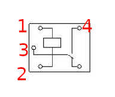

Инструкция как сделать сенсор наличия электричества в городской сети при помощи zigbee датчика открытия дверей, реле и блока питания.

За основу взят zigbee датчик открытия окна/дверей. Подойдет любой датчик у которого есть геркон.
Возможно использовать и датчик протечки - его контакты подключить к реле.

Необходимо подобрать блок питания и реле с одним напряжением. Под рукой оказались под 5v.
Можно использовать любые блок питания и реле, но с одним напряжением. Именно эти реле и БП хороши своими размерами - их можно без труда уместить в небольшом корпусе.

Важно что бы zigbee датчик был именно с герконом, а не датчиком холла. Я пытался ранее сделать на основе датчика холла и попытка была безуспешной - датчик работал, но батарейка разряжалась меньше чем за сутки. Не исключаю что тогда я что-то сделал не верно. Вот [тут](https://community.home-assistant.io/t/a-list-of-door-sensor-reed-sensor-hacks-aqara-xiaomi-others) обсуждают как можно различные подобные сенсоры использовать похожим образом.

Так же необходим именно zigbee датчик из-за времени реакции. WiFi датчики и исполнительные устройства (розетки, автоматы, прочее) имеют лаг срабатывания. Я замечал что от момента реакции датчика, до исполнения команды, может пройти 5-10 секунд.

Если у вас маломощный инвертор (например 24в или меньше) и в момент пропажи напряжения в городской сети в доме были мощные нагрузки (которые например должны отключиться автоматизацией) то инвертор какое-то время сможет обеспечить питание, но чем выше нагрузка свыше возможностей инвертора, тем меньше это время. Датчик срабатывает примерно пол секунды и скорей всего автоматизации успеют отключить нагрузки до ухода инвертора в защиту.

Более быстрый вариант датчика это esp32 и сенсор наличия переменного напряжения, но об этом в другой раз.

У этой реализации есть ньюанс - емкости в блоке питания. После пропажи электричества, блок питания какое-то время удерживает реле. У данной реализации это примерно пол секунды. Т.е. когда пропадет напряжение - датчик сработает примерно через пол секунды. При появлении напряжения срабатыватывает моментально.

Вот датчик в разобранном виде. Справа и есть тот самый геркон.

Важно что бы датчик был с герконом, а не датчиком холла. Ниже на картинке обведены места, куда необходимо припаять провода к выводам геркона.

Нам понадобятся:
1. Сам zigbee датчик
2. Реле 5v (SRD-5VDC-SL-C)
3. Блок питания 5v (HLK-5M05)
4. Немного проводов

Дальше необходимо всё это спаять.
На блок питания на AC выводы припаять провод нужной длинны, который будет подключаться к месту, где необходимо отслеживать наличие переменного напряжения.
DC выводы блока питания припаять к 1 и 2 выводам реле.
Выводы реле 3 и 4 припаять к проводам от геркона.

Выводы реле

Вот так должно получиться. В корпусе датчика выломал небольшое отверстие для проводов.

Обмотаем всё синей изолентой

Можно это все всунуть в какой нибудь корпус. У меня это корпус на дин рейку в 2 модуля

Можно подключить провода датчика к переменному напряжению и устройство готово к использованию.

Желательно использовать клеммы для более безопасного и быстрого монтажа. 

Если провода на датчике тонкие, то закручивать их вместе с толстым проводом в автомат не безопасно. Вообще в одно гнездо автомата допустимо закрутить 2 проводника одинакового сечения, если это многожильные провода, то они должны быть обжаты в наконечник.
